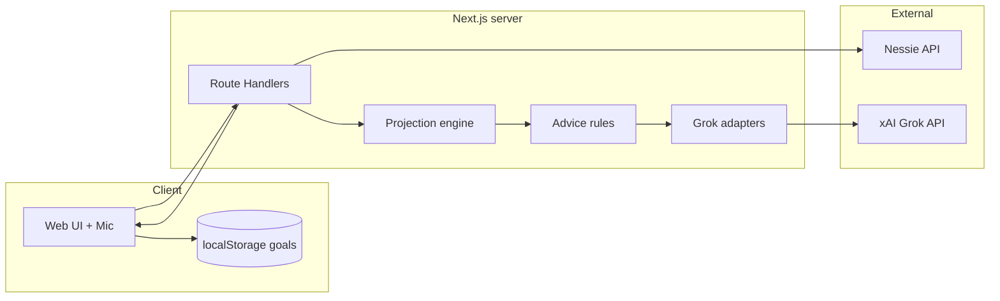

# Polaris — GPS for your money

**Cornell BigRed Hacks · Navigation theme**

Polaris (the North Star) is a voice-guided web app that helps college students reach a money goal the way GPS guides a road trip. You set a destination (amount + date), Polaris reads where you are today, projects the route forward, and gives turn-by-turn directions. When spending or bills knock you off course, it recalculates—like “rerouting”—and suggests concrete moves to get back on track.

Most budgeting tools only show what you already spent. Polaris looks **forward**: balance today minus upcoming bills, income, and typical spending, so you see whether you arrive on time.

---

## Key features

- **Destination goals** — Type or use **Grok Voice** to set targets (e.g. “$400 for a flight home by December 15”).
- **Nessie financial snapshot** — Checking/savings balances, bills, purchases, deposits, and P2P transfers from Capital One’s hackathon API.
- **Forward ETA projection** — Deterministic day-by-day math in TypeScript (`lib/projection`); the LLM does not invent numbers.
- **Turn-by-turn directions** — Rule-based facts → **Grok** natural-language guidance (templates if Grok is unavailable).
- **Rerouting** — New purchases or reported spending trigger ETA updates and recovery suggestions.
- **Constellation progress** — Goals map to real star layouts (e.g. Ursa Minor); stars light up as savings progress.
- **Grok Imagine postcards** — Motivational destination images that can sharpen as you get closer to the goal.
- **Demo mode** — Fixture snapshot or seeded **Maya** Nessie customer for judge-friendly demos ([docs/DEMO_SCENARIO.md](docs/DEMO_SCENARIO.md)).

---

## Tech stack

| Layer | Technologies |
|--------|----------------|
| Frontend | **Next.js** (App Router), **React**, **TypeScript**, **Tailwind CSS**, **shadcn/ui**, **Framer Motion** |
| State & data | **TanStack Query**, browser **localStorage** (goals, customer ID), optional **Upstash Redis** where configured |
| Financial data | **Capital One Nessie** (`https://api.nessieisreal.com`) |
| AI | **xAI Grok** — chat completions, **Imagine** (images), **Realtime Voice** (WebSocket) |
| Tooling | **Vitest**, **ESLint**, built with **Cursor** |

---

## Installation & setup

This project is **Node.js / npm**, not Python. Use a supported **Node.js 20+** runtime (recommended: [nvm](https://github.com/nvm-sh/nvm) or [fnm](https://github.com/Schniz/fnm)).

### 1. Clone the repository

```bash
git clone <your-repo-url>
cd Polaris-BigRedHacks26
```

### 2. Create and activate a Node environment (optional but recommended)

With **nvm**:

```bash
nvm install 20
nvm use 20
node -v   # should be v20.x or newer
```

With **fnm**:

```bash
fnm install 20
fnm use 20
```

### 3. Configure environment variables

```bash
cp .env.example .env.local
```

Edit `.env.local`:

| Variable | Required | Notes |
|----------|----------|--------|
| `NESSIE_API_KEY` | Yes (live demo) | From [api.nessieisreal.com](http://api.nessieisreal.com) profile |
| `XAI_API_KEY` | Recommended | Voice, directions, Imagine, chat |
| `NESSIE_CUSTOMER_ID` | Optional | Default customer; users can override in UI |
| `POLARIS_USE_FIXTURE` | Demo only | `true` = offline fixture, no Nessie calls |
| `XAI_CHAT_MODEL` | Optional | Default `grok-3-mini-fast` |
| `XAI_IMAGINE_MODEL` | Optional | Default `grok-imagine-image` |

### 4. Install dependencies

```bash
npm install
```

### 5. Initialize and seed financial data (Nessie)

Polaris does **not** use a local SQL database. Goals live in the browser; **Nessie** holds mock bank data.

**Option A — Create demo customer (recommended for live demo)**

```bash
npm run demo:nessie
```

This creates **Maya Chen** (accounts, bills, paychecks, food spend, P2P receivable), writes `NESSIE_CUSTOMER_ID` to `.env.local`, and saves credentials locally (gitignored). Details: [docs/DEMO_NESSIE.md](docs/DEMO_NESSIE.md).

**Option B — Idempotent seed script**

```bash
npm run seed:nessie
# recreate: npm run seed:nessie -- --reset
```

**Option C — Offline (no Nessie key)**

```bash
POLARIS_USE_FIXTURE=true NEXT_PUBLIC_USE_FIXTURES=true NEXT_PUBLIC_DEMO_MODE=true DEMO_MODE=true npm run dev
```

Uses `fixtures/demo-snapshot.json`.

### 6. Start the development server

```bash
npm run dev
```

Open **http://localhost:3000**.

Demo login (when demo/fixture mode is enabled): **tyreikr11@cornell.edu** / **123456789** (override with `DEMO_LOGIN_EMAIL` / `DEMO_LOGIN_PASSWORD`).

### Production build (local)

```bash
npm run build
npm start
```

Health check: `GET /api/health`.

### Other scripts

- `npm test` — projection and unit tests
- `npm run lint` — ESLint

---

## Project structure

```
Polaris-BigRedHacks26/
├── app/                    # Next.js pages and Route Handlers
│   ├── api/                # Server API (sync, goals, voice, imagine, …)
│   ├── destination/        # Goal setup flow
│   ├── goal/[id]/          # Goal detail
│   └── route/[id]/         # Star route / trip view
├── components/             # UI (constellation, ETA, voice mic, cards, …)
├── hooks/                  # React hooks (snapshot, goals, chat, …)
├── lib/
│   ├── projection/         # ETA engine (deterministic math)
│   ├── nessie/             # Nessie client, normalize, P2P transfers
│   ├── grok/               # Chat, directions, voice, Imagine, parsers
│   ├── goals/              # Goal types and storage helpers
│   ├── advice/             # Next-move and recovery rules
│   ├── constellation/      # Star progress mapping
│   └── route-map/          # Timeline and waypoints
├── data/                   # Constellation JSON, seed id metadata
├── fixtures/               # Offline demo snapshot
├── scripts/                # seed-nessie.ts, create-demo-customer.ts
├── docs/                   # Demo runbooks
└── public/                 # Static assets (e.g. postcard fallbacks)
```

---

## System design / architecture



**Design principles**

1. **Projection stays in code** — `current balance + income − bills − average daily spend`, simulated day-by-day until the goal amount or horizon. Judges get explainable math; Grok only narrates facts from tools and server responses.
2. **Keys stay server-side** — `NESSIE_API_KEY` and `XAI_API_KEY` never ship to the browser. Voice uses short-lived tokens from `/api/voice/token`.
3. **Customer scoping** — One Nessie API key; per-user data via `NESSIE_CUSTOMER_ID` (env default or header `x-polaris-customer-id` / UI).
4. **Privacy** — No app database for goals; Nessie and Grok calls proxy through your API routes.

**Typical request flow**

1. User sets destination → parse goal (Grok or heuristics) → store goal locally.
2. `GET /api/sync` loads Nessie snapshot for the customer.
3. `POST /api/project` or goal projection routes run `lib/projection`.
4. Navigate / chat / voice tools fetch ETA and next moves, then Grok phrasing.
5. UI updates constellation progress from savings ÷ target.

---

## API documentation

### Polaris app routes (this repo)

| Method | Route | Purpose |
|--------|--------|---------|
| `GET` | `/api/health` | Liveness / config sanity |
| `GET` | `/api/config` | Public feature flags |
| `GET` | `/api/sync` | Financial snapshot (`x-polaris-customer-id` header) |
| `POST` | `/api/project` | ETA projection from body snapshot + goal |
| `POST` | `/api/navigate` | GPS-style directions from projection + rules |
| `POST` | `/api/chat` | Follow-up Q&A with chat history |
| `POST` | `/api/imagine` | Destination postcard image |
| `POST` | `/api/voice/token` | Ephemeral Grok Realtime client secret |
| `POST` | `/api/voice/tool` | Server tools for voice agent (numbers from backend) |
| `POST` | `/api/goals/parse` | Parse natural-language goal |
| `GET/POST` | `/api/goals/...` | Goal CRUD, projection, events, postcard, reports |
| `POST` | `/api/transfers/request` | Create Nessie P2P transfer request |
| `POST` | `/api/auth/demo` | Demo session login |

See route files under `app/api/` for request/response shapes.

---

### Capital One Nessie API (external)

**Base URL:** `https://api.nessieisreal.com` (override with `NESSIE_API_BASE`)

**Authentication:** Query parameter `key=<NESSIE_API_KEY>` on every request.

**Endpoints used by Polaris** (see `lib/nessie/client.ts`, `lib/nessie/transfers.server.ts`):

| Method | Nessie path | Used for |
|--------|-------------|----------|
| `GET` | `/customers/{customerId}/accounts` | Account list and balances |
| `GET` | `/accounts/{accountId}/bills` | Upcoming bills |
| `GET` | `/accounts/{accountId}/purchases` | Spending history / merchants |
| `GET` | `/accounts/{accountId}/deposits` | Income / paychecks |
| `GET` | `/accounts/{accountId}/transfers` | P2P activity |
| `POST` | `/accounts/{accountId}/transfers` | Pending P2P request (e.g. collect from friend) |

Customer creation and rich seed data are handled by `npm run demo:nessie` and `scripts/seed-nessie.ts` (additional Nessie POST routes as needed for hackathon seeding).

Official docs: [Nessie API](http://api.nessieisreal.com) (hackathon portal).

---

### xAI Grok API (external)

**Base URL:** `https://api.x.ai/v1`

**Authentication:** `Authorization: Bearer <XAI_API_KEY>`

| Capability | Grok endpoint | Polaris usage |
|------------|---------------|----------------|
| Chat | `POST /chat/completions` | Directions, goal/spending parsers, follow-up chat (`lib/grok/client.ts`, `directions.ts`, parsers) |
| Images | `POST /images/generations` | Destination postcards (`lib/grok/imagine.ts`, model `grok-imagine-image` by default) |
| Realtime voice | `POST /realtime/client_secrets` | Browser WebSocket session |
| Realtime voice | `wss://api.x.ai/v1/realtime?model=grok-voice-latest` | Spoken input/output; tools call back to `/api/voice/tool` |

**Models (env defaults)**

- Chat: `XAI_CHAT_MODEL` → `grok-3-mini-fast`
- Imagine: `XAI_IMAGINE_MODEL` → `grok-imagine-image`
- Voice: `grok-voice-latest` (realtime)

Docs: [xAI Console](https://console.x.ai).

---

## Privacy

- Goals and optional customer ID stay in the **browser** unless you add server-side storage.
- Nessie and Grok traffic goes through **your** Next.js API; API keys are server-only.
- Voice sessions use **ephemeral** client secrets (≈10 minutes).

---

## Hackathon tracks

Navigation theme, **Capital One Nessie**, **Grok Voice + Imagine**, constellation / **SpaceX** angle, **UX/UI**, software craftsmanship, **Cursor**-built codebase.
